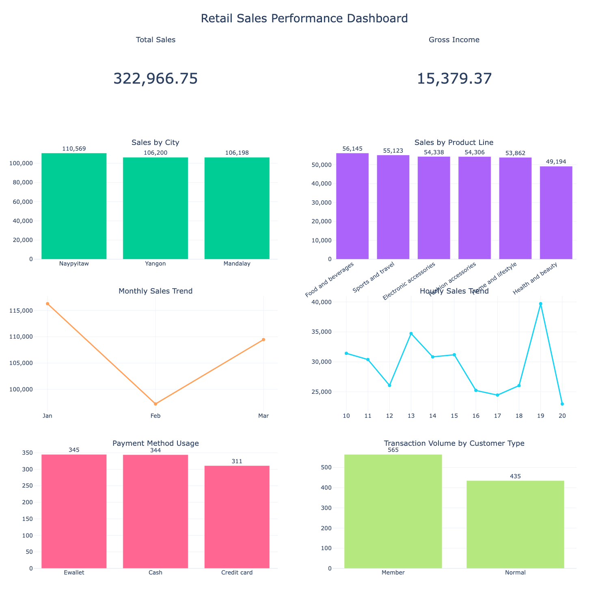

# Retail Sales Performance Analysis

An end-to-end retail sales analysis project using **PySpark, Pandas, and Plotly** to explore transaction patterns, sales performance, customer behavior, and payment methods.

## Project Overview

This project analyzes a retail supermarket transaction dataset containing **1,000 transactions and 17 original columns**.

The objective is to transform raw transaction data into meaningful business insights through data preparation, exploratory data analysis, aggregation, and interactive visualization.

## Business Questions

This project focuses on several key questions:

- Which city generates the highest sales?
- Which product line contributes the most to total sales?
- How do sales change over time?
- Which hours show the highest sales activity?
- Which payment method is most frequently used?
- How does transaction volume differ between customer types?
- What patterns can support better retail decision-making?

## Dataset

**Dataset:** Supermarket Sales Dataset

- Transactions: **1,000**
- Original columns: **17**
- Data type: Retail transaction data

The original dataset contains information such as:

- Invoice ID
- Branch
- City
- Customer type
- Gender
- Product line
- Unit price
- Quantity
- Tax
- Sales
- Date
- Time
- Payment
- COGS
- Gross margin percentage
- Gross income
- Rating

## Tools & Technologies

| Tool | Purpose |
|---|---|
| Python | Data analysis |
| PySpark | Data processing and aggregation |
| Pandas | Data manipulation |
| Plotly | Data visualization |
| Google Colab | Development environment |
| GitHub | Project documentation and version control |

## Analysis Workflow

The project follows the following workflow:

1. Data loading
2. Data inspection
3. Data quality checking
4. Data preparation
5. Exploratory Data Analysis
6. Business-oriented aggregation
7. Trend analysis
8. Visualization
9. Dashboard development
10. Business insights and recommendations

## Dashboard

The final dashboard summarizes the main findings from the analysis.

### Dashboard Components

The dashboard includes:

- **Total Sales**
- **Gross Income**
- **Sales by City**
- **Sales by Product Line**
- **Monthly Sales Trend**
- **Hourly Sales Trend**
- **Payment Method Usage**
- **Transaction Volume by Customer Type**

## Key Findings

### 1. Sales Performance by City

Naypyitaw records the highest total sales among the three cities, followed by Yangon and Mandalay.

**Implication:**  
Naypyitaw represents an important market for the business and may have stronger sales potential.

**Action:**  
The business can prioritize inventory availability, promotional campaigns, and customer retention initiatives in Naypyitaw.

### 2. Sales by Product Line

Food and beverages generates the highest sales among the product lines, while Health and beauty records the lowest sales.

**Implication:**  
Product demand varies considerably across product categories.

**Action:**  
The business should maintain sufficient inventory for high-performing product lines while evaluating targeted promotions for lower-performing categories.

### 3. Hourly Sales Pattern

Sales activity varies throughout the day, indicating that customer purchasing behavior is not evenly distributed across operating hours.

**Implication:**  
Certain periods may generate higher customer activity and sales.

**Action:**  
Staffing, inventory preparation, and promotional activities can be adjusted based on high-traffic hours.

### 4. Payment Method

Payment transactions are distributed across Ewallet, Cash, and Credit card.

**Implication:**  
Customers use multiple payment methods, so relying on a single payment channel would not adequately serve customer preferences.

**Action:**  
The business should continue supporting all major payment methods while monitoring changes in payment behavior over time.

### 5. Customer Type

Transaction volume can be compared between Member and Normal customers to understand differences in purchasing activity.

**Implication:**  
Customer membership behavior can provide opportunities for improving customer retention.

**Action:**  
The business can strengthen membership benefits and targeted promotions to encourage repeat purchases.

## Project Takeaways

This project demonstrates how raw retail transaction data can be transformed into business-oriented insights.

The analysis highlights the importance of:

- Identifying high-performing markets
- Understanding product-level sales performance
- Recognizing hourly sales patterns
- Monitoring customer payment preferences
- Comparing customer segments
- Translating analytical findings into actionable recommendations

The project also demonstrates practical experience with **PySpark for data processing**, **Pandas for analysis**, and **Plotly for dashboard visualization**.
